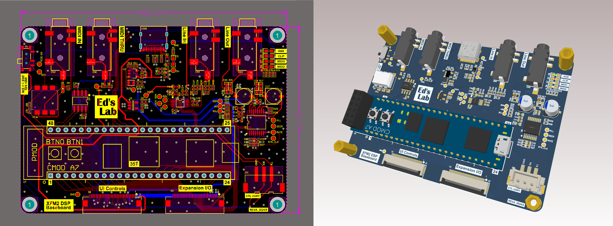

# xSynth-go
A portable FPGA-based Synthesizer/DSP processor built on the Digilent CMOD A7 35T FPGA.

## Overview
This project aims to create a portable hardware platform for interacting with the XFM2, originally created by René Ceballos. The hardware is designed with portability and scalability in mind, making it not only compatible with XFM2 but also a useful open hardware platform for FPGA DSP/Synth development. It is capable of audio signal input/output and MIDI input/output, making it scalable for those who want to design custom FPGA effect processors, or for those interested in learning FPGA signal processing.

## Hardware Build

### System block diagram
- `FPGA baseboard`: Left section of the system diagram. The design is completed and can work as standalone unit and be controlled over MIDI and UART interface.
- `MCU board`: Right section of the system diagram. It is for screen/keyboard UI controls and USB MIDI device. Hardware design is still "work in progress".

## Key Features:
- Compatibility with [XFM DIY Synthesizer](https://www.futur3soundz.com/xfm2/) by René Ceballos.
- Utilizes the powerful [Digilent CMOD A7 35T FPGA](https://digilent.com/shop/cmod-a7-35t-breadboardable-artix-7-fpga-module/).
- MIDI In (Type A) and MIDI Thru/Out (Type A).
- Line-In/Out 3.5mm Jack.
- USB-C Powered.
- USB Device mode (available in `UI FPC connector`).
- All additional pin-outs are wired out to FPC for off-board expansions.
- All control pinouts needed for hardware UI interface are connected via one FPC.

### Future Supports:
- USB MIDI Device via Type-C.
- Hardware UI controller (screen and mechanical keyboard) for user interactions.
- Micro-SD card for patch storage.
***

### 📝 To-Do List 
- [ ] Validate Rev(A) PCB hardware and reference designs.
- [ ] Design UI board Hardware PCB.
- [ ] Create a system diagram of the hardware.

### ✅ Completed Tasks 
- [x] 2024/06 Rev(A) Base DSP PCB design is completed.

---
### Directory
- [Hardware Source Files](hardware/XFM2-Baseboard-RevA_2024_06_01/)
- [Schematics](hardware/XFM2-Baseboard-RevA_2024_06_01/XFM2-Baseboard_RevA_2024_06_01/XFM2-BASE-BOARD_SCH.pdf)
- [Bill of Materials](hardware/XFM2-Baseboard-RevA_2024_06_01/XFM2-Baseboard_RevA_2024_06_01/XFM2-BASE-BOARD-BOM.xls)

## Acknowledgements  
- [XFM2 DIY Synthesizer](https://www.futur3soundz.com/xfm2/), a project by `René Ceballos`.
- Line-Out Reference Design from [Adafruit I2S Stereo Decoder - UDA1334A](https://www.adafruit.com/product/3678).
- Line-In Reference Design from [Digilent Pmod I2S2](https://digilent.com/reference/pmod/pmodi2s2/reference-manual).
